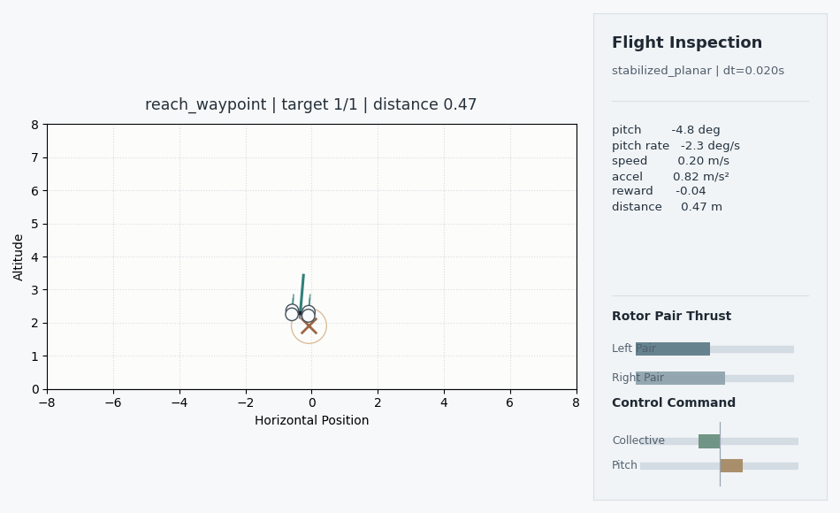
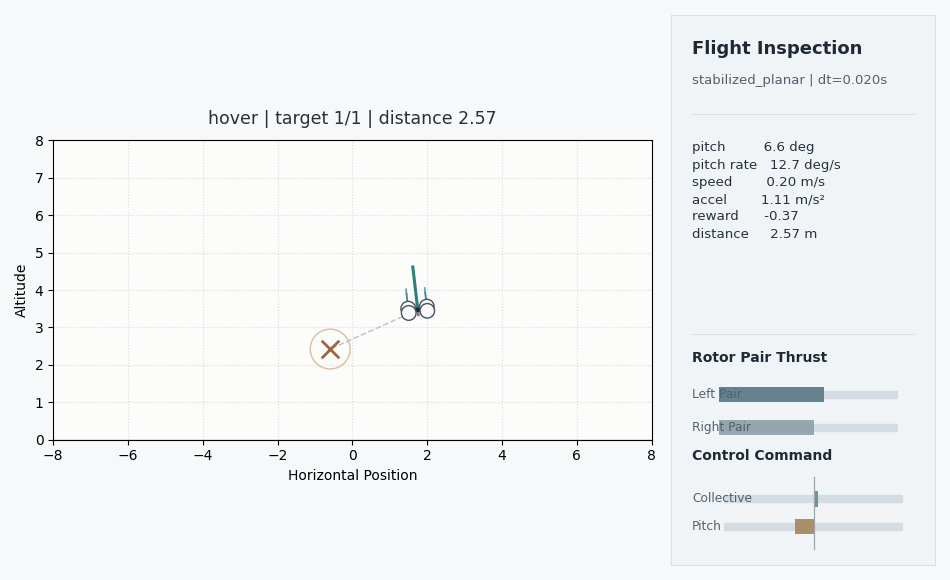

# FlightRL

FlightRL is a research-oriented drone RL scaffold built around a small C simulator and a thin PufferLib Ocean-style Python wrapper. The goal is fast simulation throughput, modular environment structure, and a clean path toward richer sensor models, manufacturer-specific parameter profiles, and later sim-to-real work on civilian developer platforms.

## Renderer Preview

Clean previews exported from the live renderer. The inspection view shows a quadrotor airframe, target geometry, body orientation, thrust axis, and a compact telemetry panel with command state plus left/right rotor-pair thrust. The underlying MVP dynamics are still planar, so the renderer visualizes a reduced-order quadrotor rather than full 3D motor physics:

| Reach waypoint | Hover |
| --- | --- |
|  |  |

## Open Source

- License: [MIT](LICENSE)
- Contributions: [CONTRIBUTING.md](CONTRIBUTING.md)
- Conduct: [CODE_OF_CONDUCT.md](CODE_OF_CONDUCT.md)
- Security reporting: [SECURITY.md](SECURITY.md)
- CI: GitHub Actions under `.github/workflows/`

## Why C + PufferLib Ocean

The native simulator keeps state, stepping, reward logic, reset sampling, and observation assembly in C so Python overhead stays minimal. The Python wrapper only defines spaces, owns shared buffers, exposes config loading, and plugs the environment into `pufferlib.PufferEnv` and `PuffeRL`.

The implementation follows the current Ocean pattern:

- C writes directly into contiguous NumPy buffers.
- Python vectorization happens inside the native env rather than through a pure Python loop.
- The binding layer is split into small local headers instead of copying the upstream Ocean bridge as one large file.

## Repository Layout

- `src/flightrl/`: config loading, native env wrapper, policy, training helpers, rollout and plotting utilities.
- `src/flightrl/native/`: modular C simulator, reward/task logic, and Ocean-style binding bridge.
- `configs/tasks/`: runnable hover, waypoint, and sequence experiment configs.
- `configs/hardware/`: placeholder hardware-oriented profile examples.
- `scripts/`: train, eval, benchmark, rollout, plotting, comparison, and smoke-test entrypoints.
- `tests/`: lightweight regression and smoke coverage.
- `docs/architecture.md`: module boundaries and extension path.

## Build

Editable install:

```bash
python -m pip install -e . --no-build-isolation
```

PufferLib currently advertises an older NumPy constraint than many Python 3.13 environments already use. In a shared interpreter, `pip` may try to reshuffle NumPy during install; a dedicated virtualenv is the safer setup.

Direct extension rebuild:

```bash
python setup.py build_ext --inplace --force
```

Convenience targets:

```bash
make dev
make build
make test
```

## Smoke Test

```bash
python scripts/smoke_test.py --config configs/tasks/hover.toml
```

## Train

```bash
python scripts/train.py --config configs/tasks/hover.toml
python scripts/train.py --config configs/tasks/reach.toml
```

The training loop uses a small Gaussian actor-critic and calls `PuffeRL` directly. Configurable sections live in TOML under:

- `environment`
- `drone`
- `sensors`
- `task`
- `reward`
- `training`
- `domain_randomization`
- `logging`

## Evaluate And Roll Out

Random rollout:

```bash
python scripts/rollout_random.py --config configs/tasks/hover.toml
python scripts/rollout_random.py --config configs/tasks/hover.toml --render-mode human
```

Policy evaluation:

```bash
python scripts/eval.py --config configs/tasks/reach.toml --checkpoint artifacts/<run>/model_000004.pt
python scripts/eval.py --config configs/tasks/reach.toml --checkpoint artifacts/<run>/model_000004.pt --render-mode human
```

Trajectory plotting:

```bash
python scripts/plot_trajectory.py --input artifacts/trajectories/random_rollout.csv
```

Reward comparison:

```bash
python scripts/compare_rewards.py --left rollout_a.csv --right rollout_b.csv
```

Environment-only throughput benchmark:

```bash
python scripts/benchmark_env.py --config configs/tasks/hover.toml
```

The environment also exposes Gymnasium-style rendering through `DronePlanarEnv(render_mode="human")` and `DronePlanarEnv(render_mode="rgb_array")`. Rendering is lazy and stays out of the fast path unless explicitly enabled.

To export a clean preview frame without a desktop window:

```bash
python scripts/export_render_preview.py --config configs/tasks/reach.toml --output docs/images/reach-preview.png
```

## Tasks In The MVP

- `hover`: stabilize near a hover target for a configured hold duration.
- `reach_waypoint`: reach one sampled or fixed waypoint.
- `follow_waypoints`: progress through a sequence of waypoints.

Obstacle avoidance, live native rendering, and richer vision/range sensors are intentionally deferred. If unsupported sensor flags are enabled, the config path errors explicitly instead of falling back to mock data.

## Add A New Task

1. Add a new task enum mapping in `src/flightrl/env.py`.
2. Extend native task progression in `src/flightrl/native/native_tasks.c`.
3. Adjust reward or termination logic only if the new task needs different completion behavior.
4. Add a new TOML task config under `configs/tasks/`.
5. Add at least one regression test in `tests/`.

## Sim-To-Real Readiness

The scaffold is organized around swappable task, reset, reward, sensor, and action layers rather than a hardcoded one-off drone. The hardware profile placeholder under `configs/hardware/manufacturer_placeholder.toml` shows where to start for:

- manufacturer-specific mass, thrust, drag, and actuator lag
- noisier sensor profiles
- switching from stabilized commands to direct actuator-style control
- future parameter-fitting or replay-driven calibration workflows
