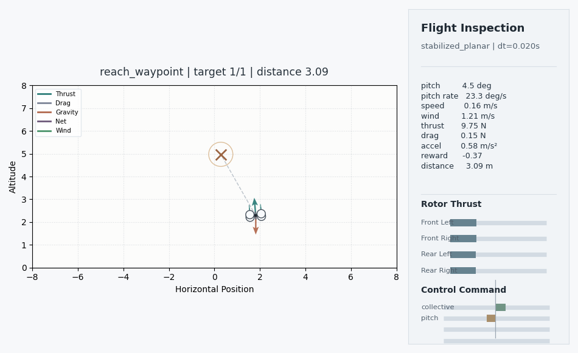
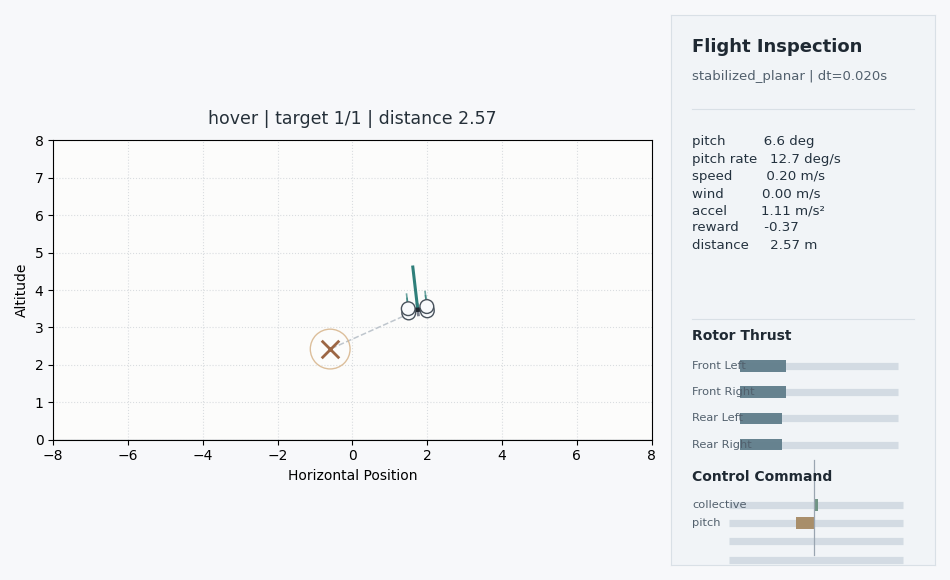

# FlightRL

FlightRL is a research-oriented drone RL scaffold built around a small C simulator, a local Python evaluation wrapper, and an export path into upstream PufferLib 4. The goal is fast simulation throughput, modular environment structure, and a clean path toward richer sensor models, manufacturer-specific parameter profiles, and later sim-to-real work on civilian developer platforms.

## Renderer Preview

Clean previews exported from the live renderer. The inspection view shows a quadrotor airframe, per-rotor thrust state, target geometry, body orientation, color-coded force vectors, and compact telemetry. The underlying MVP dynamics are still planar, so direct `motor_quad` control is physically meaningful through front-vs-rear pitch authority, while left-vs-right asymmetry remains future-facing until a fuller 3D model lands:

| Reach waypoint | Hover |
| --- | --- |
|  |  |

## Open Source

- License: [MIT](LICENSE)
- Contributions: [CONTRIBUTING.md](CONTRIBUTING.md)
- Conduct: [CODE_OF_CONDUCT.md](CODE_OF_CONDUCT.md)
- Security reporting: [SECURITY.md](SECURITY.md)
- CI: GitHub Actions under `.github/workflows/`

## Why C + PufferLib 4

The native simulator keeps state, stepping, reward logic, reset sampling, and observation assembly in C so Python overhead stays minimal. FlightRL owns a small local Python wrapper for rollout collection and rendering, but the training path is the upstream PufferLib 4 Ocean/native build flow.

FlightRL exports its simulator modules into a generated `binding.c` plus `.ini` config inside a separate PufferLib `4.0` checkout. That matches the upstream 4.0 API surface instead of relying on the removed `PufferEnv`/`vector`/`emulation` interfaces from older releases.

The implementation follows the current Ocean pattern:

- C writes directly into contiguous NumPy buffers.
- Python vectorization happens inside the native env rather than through a pure Python loop.
- The binding layer is split into small local headers instead of copying the upstream Ocean bridge as one large file.

## Repository Layout

- `src/flightrl/`: config loading, local env wrapper, policy loaders, PufferLib 4 runtime helpers, rollout and plotting utilities.
- `src/flightrl/native/`: modular C simulator, reward/task logic, and Ocean-style binding bridge.
- `configs/tasks/`: runnable hover, waypoint, and sequence experiment configs.
- `configs/hardware/`: placeholder hardware-oriented profile examples.
- `scripts/`: train/export/eval helpers that target the local wrapper or an upstream PufferLib 4 checkout.
- `tests/`: lightweight regression and smoke coverage.
- `docs/architecture.md`: module boundaries and extension path.
- `docs/crazyflie_bringup.md`: Crazyflie 2.1 Brushless setup, dry-run checks, demo flight, and telemetry logging.
- `docs/crazyflie_6dof_training.md`: simulation-only 6-DoF Crazyflie training, replay, and room visualization track.
- `docs/sim_to_real_roadmap.md`: indoor-first hardware, VLA, and sim-to-real roadmap.

## Build

Editable install:

```bash
python -m pip install -e . --no-build-isolation
```

Crazyflie hardware bring-up tools are optional:

```bash
python -m pip install -e ".[hardware,dev]" --no-build-isolation
```

PufferLib is no longer a package dependency of FlightRL itself. Training runs through a separate upstream PufferLib 4 checkout, either passed explicitly with `--pufferlib-root` or via `PUFFERLIB_ROOT`.

Direct extension rebuild:

```bash
python setup.py build_ext --inplace --force
```

Convenience targets:

```bash
make dev
make build
make test
```

## Smoke Test

```bash
python scripts/smoke_test.py --config configs/tasks/hover.toml
```

## Train

```bash
python scripts/train.py --config configs/tasks/hover.toml --pufferlib-root /path/to/PufferLib
python scripts/train.py --config configs/tasks/reach.toml --pufferlib-root /path/to/PufferLib
```

`scripts/train.py` is the main training entrypoint. `scripts/train_puffer4.py` is kept as an alias. Both export the current FlightRL simulator into the target upstream checkout, optionally rebuild it, and then run `python -m pufferlib.pufferl train`.

Configurable sections still live in TOML under:

- `environment`
- `drone`
- `sensors`
- `task`
- `reward`
- `training`
- `domain_randomization`
- `logging`

Verified on April 6, 2026 against the official `4.0` branch: FlightRL trains through the upstream 4.0 checkout and no longer depends on the removed Python trainer APIs from older PufferLib versions.

Export only:

```bash
python scripts/export_puffer4.py \
  --config configs/tasks/hover.toml \
  --pufferlib-root /path/to/PufferLib
```

Export, build, and train through the upstream `4.0` checkout:

```bash
python scripts/train.py \
  --config configs/tasks/hover.toml \
  --pufferlib-root /path/to/PufferLib
```

On macOS, the upstream CPU path is toolchain-sensitive. The verified smoke on this host used Apple clang with local wrapper scripts that neutralize upstream `-fopenmp` flags while keeping `libomp` headers available. Plain Apple clang failed immediately on `-fopenmp`, and plain Homebrew LLVM built an extension that later became unstable under the torch fallback runtime.

Useful overrides:

- `--build-mode float` for the Torch-compatible float32 build
- `--build-mode cpu` for the CPU torch fallback backend. `scripts/train.py` adds upstream `--slowly` automatically in this mode.
- `--total-agents`, `--num-buffers`, and `--num-threads` to override exported vector settings
- `--policy-hidden-size` and `--policy-num-layers` to override the exported policy geometry
- pass additional Puffer CLI args after `--`, for example `-- --train.learning-rate 0.005`

The exporter writes:

- `ocean/flightrl/binding.c` generated from the current FlightRL config
- the current simulator C modules copied from `src/flightrl/native/`
- `config/flightrl.ini` with translated vec/policy/train settings

## Evaluate And Roll Out

Random rollout:

```bash
python scripts/rollout_random.py --config configs/tasks/hover.toml
python scripts/rollout_random.py --config configs/tasks/hover.toml --render-mode human
```

Policy evaluation:

```bash
python scripts/eval.py --config configs/tasks/reach.toml --checkpoint artifacts/<run>/model_000004.pt
python scripts/eval.py --config configs/tasks/reach.toml --checkpoint /path/to/checkpoint.bin --render-mode human
```

`scripts/eval.py` can load:

- raw native PufferLib 4 `.bin` checkpoints
- torch `--slowly` checkpoints emitted by the upstream torch backend

If training used non-default policy settings, pass the matching `--policy-hidden-size` and `--policy-num-layers` values to `scripts/eval.py`.

Trajectory plotting:

```bash
python scripts/plot_trajectory.py --input artifacts/trajectories/random_rollout.csv
```

Reward comparison:

```bash
python scripts/compare_rewards.py --left rollout_a.csv --right rollout_b.csv
```

Simulation-only Crazyflie 6-DoF teacher imitation:

```bash
python scripts/train_sixdof_teacher.py --task obstacle_avoidance
python scripts/rollout_sixdof_policy.py \
  --checkpoint artifacts/checkpoints/sixdof_obstacle_avoidance.pt \
  --output artifacts/trajectories/sixdof_obstacle_avoidance.csv
python scripts/visualize_crazyflie_room.py \
  --input artifacts/trajectories/sixdof_obstacle_avoidance.csv
```

The 6-DoF checkpoints are not approved for live Crazyflie deployment. See [docs/crazyflie_6dof_training.md](docs/crazyflie_6dof_training.md).

Native 6-DoF stepping benchmark:

```bash
python scripts/benchmark_sixdof_native.py --num-envs 8192 --steps 1000
```

Export the native 6-DoF environment into an upstream PufferLib 4 checkout:

```bash
python scripts/export_sixdof_puffer4.py --pufferlib-root /path/to/PufferLib
python scripts/train_sixdof_puffer4.py --pufferlib-root /path/to/PufferLib --build-mode cpu -- --train.total-timesteps 32768
```

Environment-only throughput benchmark:

```bash
python scripts/benchmark_env.py --config configs/tasks/hover.toml
```

The environment exposes Gymnasium-style rendering through `DronePlanarEnv(render_mode="human")` and `DronePlanarEnv(render_mode="rgb_array")`. Rendering is lazy and stays out of the fast path unless explicitly enabled.

The exported PufferLib 4 env is currently focused on training. Native `puffer eval` rendering is stubbed out until the renderer is ported into the upstream raylib-based C path.

Export a trained 6-DoF simulation checkpoint to a local edge-inference artifact:

```bash
python scripts/export_sixdof_edge_policy.py --checkpoint artifacts/checkpoints/sixdof_position_yaw_h256_long.pt
```

This writes a TorchScript model and parity report under `artifacts/edge/`. It is a deployment contract and local smoke test, not approval to run the model directly on the Crazyflie.

Supported action modes:

- `stabilized_planar`: two commands, collective thrust and pitch torque.
- `motor_pair`: two direct commands for front-pair and rear-pair thrust.
- `motor_quad`: four direct normalized rotor commands for front-left, front-right, rear-left, and rear-right actuators.

Wind support is also built into the native dynamics through air-relative drag plus correlated gusts. Example config:

```toml
[wind]
enabled = true
steady_x = 2.0
steady_z = 0.0
gust_strength = 0.4
gust_tau = 0.3
```

To export a clean preview frame without a desktop window:

```bash
python scripts/export_render_preview.py --config configs/tasks/reach.toml --output docs/images/reach-preview.png
```

## Tasks In The MVP

- `hover`: stabilize near a hover target for a configured hold duration.
- `reach_waypoint`: reach one sampled or fixed waypoint.
- `follow_waypoints`: progress through a sequence of waypoints.

Obstacle avoidance, live native rendering, and richer vision/range sensors are intentionally deferred. If unsupported sensor flags are enabled, the config path errors explicitly instead of falling back to mock data.

## Add A New Task

1. Add a new task enum mapping in `src/flightrl/env.py`.
2. Extend native task progression in `src/flightrl/native/native_tasks.c`.
3. Adjust reward or termination logic only if the new task needs different completion behavior.
4. Add a new TOML task config under `configs/tasks/`.
5. Add at least one regression test in `tests/`.

## Sim-To-Real Readiness

The scaffold is organized around swappable task, reset, reward, sensor, and action layers rather than a hardcoded one-off drone. The hardware profile placeholder under `configs/hardware/manufacturer_placeholder.toml` shows where to start for:

- manufacturer-specific mass, thrust, drag, and actuator lag
- noisier sensor profiles
- switching from stabilized commands to direct actuator-style control
- future parameter-fitting or replay-driven calibration workflows

For future autonomy work, the intended control hierarchy is:

`camera + telemetry + mission context -> VLA navigator -> high-level commands -> stabilizer/controller -> motor mixing`

That keeps low-level stabilization fast and local while allowing a slower perception-conditioned model to handle navigation and mission semantics later.

For the first real hardware setup, see [docs/crazyflie_bringup.md](docs/crazyflie_bringup.md). The current Crazyflie layer supports safe scripted MotionCommander bring-up and telemetry logging; learned policies remain sim-only until a 6-DoF model, replay checks, and deployment safety gates are implemented.
