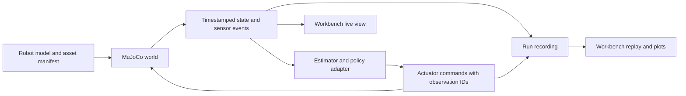

# Robotics retrospective and next implementation milestone

Date: 2026-09-06. Objective: win industrial pilots and hardware partners.
Scope: current code and retained measurements, model-source inspection, and a
proposed implementation sequence. This review does not add runtime capabilities.

## Decision

Build one reusable robotics workbench around a trustworthy run record and an
actual articulated model. Start with industrial inspection and production cells.
Keep the current drone/rover demonstration, add an xArm7 with a wrist camera, and
make the same scene, entity selection, sensor panels and timeline serve all three.
The value proposition is faster integration and measurable policy validation for
a partner's robot and task. More scenery alone does not establish that value.

The China preparation recording confirms hardware sourcing/partnerships as the
Sunderlabs ask and industrial customer discovery in Taicang. The May programme
tentatively names FAIRINO and ZELOS; it is not a confirmed September host list.
Detailed trip/funding analysis is saved separately with the private trip papers.

## Current capabilities and gaps

| Area | Verified current implementation | Gap before claiming general support |
| --- | --- | --- |
| Physics | MuJoCo rigid bodies, contacts, drone body-force dynamics and actuated rover wheels | Surrogate mechanics; no identified agricultural airframe, articulated controller or tire/suspension model |
| Model identity | `robotics/spec.py` extracts compiled links, inertias, joints and some actuator parameters | It does not import arbitrary robots into the whole runtime; rejects all non-joint transmissions |
| World/runtime | Shared stepping and state transport for two robots | Fixed robot names, state offsets, two roles, fixed camera bindings and action interpretation |
| Rendering | Detailed procedural industrial sites, physical primitive geometry and actual RGB-D | Mesh/capsule import and arbitrary articulated scene hierarchy are missing |
| Learning | 5,828-parameter imitation policy for drone/rover visual-servo velocity commands | Not a general task planner, raw-motor policy or learned joint controller |
| Sensing | Rendered cameras, marker measurements, noisy depth, biased proprioception and outages | No calibrated VIO, thermal/gas sensing, generic sensor registry or calibrated uncertainty |
| Evidence | Seed/controller identity, reports, image hashes, traces and some observation samples | Mixed capture/evaluation times; incomplete recording; no synchronized arbitrary seek |
| Interface | Free observer movement, trails and two camera feeds | Separate pages and fixed two-robot panels instead of one run-centric workbench |

Primary code inspected: `src/flightrl/robotics/{spec,world,environment,mission,
sensor_rig,session}.py`, `scripts/run_robotics.py`,
`viewer/src/robotics/{main,scene}.ts`, `viewer/src/realism/cameras.ts`.

## Timing findings that should be fixed first

1. `InspectionMission.record()` reads camera position from current MuJoCo state,
   while its image, hash and `time_s` belong to a previously captured observation.
   The sensor rig delays delivery by one batch. An event therefore mixes times.
   Score the captured camera pose against truth at that capture, and separately
   record the decision/application time. Preserve the old reports as historical
   results; re-run scoring before calling them synchronized evidence.
2. `Session.receive()` retains newest raw low-resolution drone RGB-D/proprioception
   alongside commands calculated after delayed observation delivery. Each action
   needs the IDs of the observations that actually caused it. Otherwise these
   samples are unsuitable as explicitly aligned observation/action trajectories.
3. The UI shows latest world transforms beside older raw camera images; the policy
   sees an additionally delayed/noisy observation. Expose these distinct views and
   frame ages. A synchronized replay must put the world at the selected image time.
4. The current camera delay is one batch, recorded as 0.1 seconds. That equivalence
   assumes regular delivery; it is not a measured fixed-duration latency guarantee.
5. Only the first 150 low-resolution drone samples, sparse position traces and
   inspection images are retained. There is no complete all-robot sensor history.
6. Some camera-envelope fields contain compatibility values (zero wind/contacts,
   empty velocities/rates). These must not become apparently measured dashboard
   telemetry. Remove unsupported fields or represent availability explicitly.

These are code-path findings, not a new reproduction of a real-hardware fault.
They limit the interpretation of prior evidence without proving every outcome
was wrong. Existing collision counters are a separate physical check.

## Import real robots without confusing geometry with dynamics

An import needs meshes, a link/joint tree, mass and inertia, collision shapes,
joint limits, actuator behavior, sensor mounts and a declared control interface.
A nice CAD model supplies only part of that information.

| Candidate | Evidence inspected | Decision |
| --- | --- | --- |
| UFactory xArm7 | Menagerie MJCF, BSD-3-Clause licence, seven arm actuators and a tendon-driven gripper with equality constraints | First articulated reference; preserve those semantics and test the complete model |
| FAIRINO FR5 | Manufacturer URDF has seven links/inertials, six revolute joints and effort/velocity limits | Strong tentative itinerary fit; obtain model/mesh reuse rights and calibrated actuator data before redistribution |
| Agricultural drone, e.g. DJI AGRAS T50 | Manufacturer publishes specifications; 52 kg with battery and substantial variable payload, versus our 0.377 kg surrogate | Separate airframe adapter and identification project; no calibrated open model was verified in this research |
| Quadruped/humanoid | Official Unitree MuJoCo ecosystem and Menagerie provide starting points | Follow a customer requirement such as stairs; locomotion/contact training is a separate milestone |
| Marine robot | No marine implementation in the reviewed runtime | Add buoyancy, hydrodynamics and marine sensing only with a concrete pilot |

xArm source inspected at Menagerie commit
`8161bba264d7fa7c99ca301e91e7fb44737676ad`.
[Model and derivation](https://github.com/google-deepmind/mujoco_menagerie/tree/8161bba264d7fa7c99ca301e91e7fb44737676ad/ufactory_xarm7).
Its tendon actuator directly exercises a currently rejected import case.

FAIRINO source inspected at commit
`5bed0b0263c8f1e95f51aa45079f904d463c5c50`: no repository licence file was listed;
`fairino_description/package.xml` says `TODO: License declaration`. The URDF has
no transmissions; joint limits alone do not identify servo dynamics.
[Manufacturer package](https://github.com/FAIR-INNOVATION/frcobot_ros2/tree/5bed0b0263c8f1e95f51aa45079f904d463c5c50/fairino_description).

Agriculture also needs thrust/torque maps, rotor interactions, motor delay,
payload-dependent mass/CG/inertia and the intended autopilot command interface.
Fluid slosh and spray deposition matter for spraying tasks, not automatically for
an empty-airframe inspection demonstration.
[DJI specifications](https://ag.dji.com/t50/specs).
[Official Unitree simulator](https://github.com/unitreerobotics/unitree_mujoco).

Use MuJoCo as the mechanical authority and retain native compiled semantics.
URDF conversion is supported, but URDF alone does not contain every actuator or
simulation property; conversion needs validation and sometimes explicit MJCF
extensions. [MuJoCo modelling](https://mujoco.readthedocs.io/en/stable/modeling.html).
No external robot was installed, loaded or benchmarked during this review.

## Proposed software boundary



- `RobotAsset`: versioned model plus dependency hashes, licence, visual/collision
  assets and declared physical provenance. Hash included XML and meshes too.
- `RobotInstance`: stable instance ID, namespaced links/joints/sensors and compiled
  ID/address mappings. No fixed qpos offsets or name-prefix ownership inference.
- `ActuatorInterface`: position, velocity, torque or rotor-command semantics,
  units, limits, rates, gearing/dynamics and transmission ownership. Retain tendon
  and equality behavior; reject unsupported semantics with a specific error.
- `SensorStream`: calibration, mount transform, clock, sample rate, validity and
  acquisition/delivery timestamps. A renderer remains one sensor provider.
- `Task`: goals, rewards, termination and independent evaluation, separate from
  embodiment-specific controllers. Compatible models share policies; different
  action spaces require explicit adapters or separate controllers.
- `Run`: model/scene/controller identity, seeds, schema versions and append-only
  events. Replay recorded evidence without silently executing today's policy.

This is a small set of contracts around the current system, not a request to
replace the renderer, physics engine or training stack wholesale.

## Unified dashboard design

```text
Scenes       Robots       Runs
Run: production inspection     Controller: …     LIVE / REPLAY
┌ Entities ──────┬ Scene / selected robot view ─────┬ Inspector ────────┐
│ Drone         │ Free orbit / follow / onboard   │ RGB / depth      │
│ Rover         │ Selected link + orientation     │ IMU / odometry   │
│ Arm           │ Sensor frusta, paths, contacts   │ Joints / commands│
│  wrist camera │                                 │ Calibration      │
├───────────────┴─────────────────────────────────┴──────────────────┤
│ One timeline: image captures, deliveries, actions, events, outages │
│ Linked charts: selected signals + reference/estimate/truth         │
└───────────────────────────────────────────────────────────────────┘
```

Select a robot once; its camera feeds and available sensors populate the same
panels. Pin another feed for comparison. Historical runs reuse this layout.
Scene edits start a new episode with a new identity; they do not mutate old runs.
Keep simulator truth, estimated state and the policy's actual observations visibly
distinct. Show invalid or missing samples as gaps, not plausible replacement data.

Suggested charts: joint position/velocity/effort and target tracking; clearance
and contacts; IMU/odometry; image age, dropout and timing; mission events and
baseline-versus-policy results. Battery/energy/temperature appear only when a
corresponding model or measured stream exists.

Each event should include `run_id`, `episode_id`, `robot_id`, `stream_id`, sequence,
clock ID, integer simulation tick/time, acquisition time, publication/receipt time,
frame ID, calibration revision and validity. Actions add causal observation IDs,
decision time and application tick. Hardware needs measured clock offset/drift
and uncertainty; one workstation timestamp does not synchronize separate devices.

Use one simulation clock; different sensors need not have the same frequency.
Support capture-time inspection and delivery-time policy replay explicitly.
Interpolate continuous poses only with declared bounds; never interpolate images,
dropouts, contacts or across resets. Physical simulation and scoring continue
independently of display refresh. Rendering interpolation must not leak into sensing.

## Standards and reuse

Adopt SI units and ROS frame conventions at the boundary, including body versus
camera optical axes. Camera image headers describe acquisition time; carry
matching intrinsics/extrinsics and encoding. Our depth is currently metric ray
range: converting it to optical-axis Z depth requires an explicit transformation.
[REP-103 source](https://github.com/ros-infrastructure/rep/blob/master/rep-0103.rst),
[ROS 2 Image definition](https://github.com/ros2/common_interfaces/blob/rolling/sensor_msgs/msg/Image.msg).

Use MCAP for indexed stream recording/export. Its log and publish timestamps
remain distinct from acquisition time carried in the message schema.
[MCAP specification](https://mcap.dev/spec).
Evaluate Foxglove for engineering replay and synchronized plots before rebuilding
those tools; our Three.js workbench can remain the presentation surface. Do not
assume Foxglove embedding/distribution rights from MCAP's open specification.
[Foxglove plots and time sources](https://docs.foxglove.dev/docs/visualization/panels/plot).

Current status: partial foundations, not complete interoperability or industrial
qualification. ROS-compatible messages and replay would establish useful exchange
contracts, not certify physical robot safety or sim-to-real fidelity.

## Performance budget

Retained measurements on the M4 Max, re-read from
`artifacts/industry-expansion-20260906/assessment.json`:

| Path | Existing result | Interpretation |
| --- | --- | --- |
| Normal visual run, 1536×864 | 30 fps; 9.99 camera batches/s | Present demo meets its display/sensor cadence |
| Camera batch latency p95 | 46.67 ms against a nominal 100 ms period | Some scheduling margin; not measured GPU utilization |
| Physics/control p95 | 1.94 ms per 20 ms update | Simple pair physics has substantial local margin |
| Fast visual evaluation | 2.71–2.88× real time | Camera-inclusive serial path is much tighter than physics alone |
| Isolated CPU physics | 23.3–23.8× aggregate real time across 1/4/8 serial worlds | Excludes browser cameras and visual policy; not per-environment speed at batch eight |

The old evaluator records 8/8 success for both classical and learned controllers
over two authored site families. The timing finding above requires revised evidence
scoring before those figures are promoted to a synchronized validation claim.
No whole-Mac GPU saturation, thermal soak or articulated workload was measured.

Keep MuJoCo CPU physics for the next prototype; benchmark before choosing another
backend. Budget cameras by resolution/rate and schedule independent streams.
Keep actor sensing stable when reducing observer detail. Use instancing and LOD
for distant scenery, bounded particles and simplified collision meshes. Dust
appearance can be cosmetic; if dust affects a policy, separately model and test
the associated visibility/sensor changes. Avoid a custom fluid solver now.

## Ordered implementation and acceptance gates

1. **Correct time and recording.** Fix captured-pose scoring and action provenance;
   introduce stream IDs and a complete run recorder. Test delayed/out-of-order
   delivery, reset, camera dropout and evidence/action alignment. Re-score held-out
   drone/rover episodes without training on their outcomes.
2. **Import one complete xArm7.** Preserve meshes, all joints, tendon/gripper
   constraints, limits and actuator behavior. Replace hardcoded instance mapping.
   Validate joint limits, gravity holding, collisions, arbitrary camera-mount
   transforms and asset identity; compare against the source MuJoCo model.
3. **Deliver one workbench.** Entity selection, selectable feeds, live/replay,
   common timeline and joint/sensor plots from the same recorded stream. A paused
   image and displayed robot pose must refer to the same capture time.
4. **Add one meaningful arm task.** Wrist-camera inspection/reaching in a detailed
   production maintenance cell, with classical IK/servo baseline first. Train an
   explicit joint-setpoint policy and evaluate held-out poses/payloads/occlusions.
   Claim manipulation only after adding and validating actual contact/grasp tasks.
5. **Partner validation.** Obtain a reference robot, calibration and actuator logs,
   one real inspection asset and agreed success/failure limits. Add advanced tires,
   stairs, spray, thermal or marine physics only as that task requires them.

Suggested performance gates for the new workload: maintain 30 fps observer and
declared sensor rates, p95 camera completion below its period, stable queues and
memory over a 15-minute run, and report 1/4/8-world throughput with and without
cameras. These are proposed acceptance targets, not newly measured results.

For China, demonstrate existing bounded autonomy plus the first verified import
and shared view if complete. Keep the remaining sequence explicit. A simulation
win, photorealistic mesh or successful import does not establish hardware readiness.
